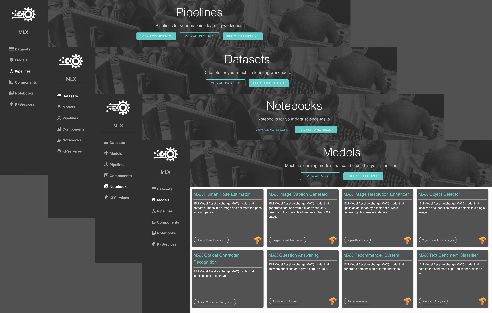

[](https://github.com/machine-learning-exchange/mlx)

# Machine Learning Exchange (MLX)

**Data and AI Assets Catalog and Execution Engine**


## 1. Prerequisites

* An existing Kubernetes cluster. Version 1.16+
* The minimum capacity requirement for MLX is 8 vCPUs and 16GB RAM
* If you are using IBM Cloud, follow the appropriate instructions for standing up your Kubernetes cluster using [IBM Cloud Public](https://cloud.ibm.com/docs/containers?topic=containers-cs_cluster_tutorial#cs_cluster_tutorial)
* If you are using OpenShift on IBM Cloud, please follow the instructions for standing up your [IBM Cloud Red Hat OpenShift cluster](https://cloud.ibm.com/docs/containers?topic=containers-openshift_tutorial)
* [`kustomize v3.0+`](https://kubernetes-sigs.github.io/kustomize/installation/) is installed

## 2. Deployment


For Deployment, we are going to use an Operator based on [Kubeflow Operator](https://www.kubeflow.org/docs/operator/introduction/) architecture. You can install the operator manually or via OperatorHub. Both should achieve the same result. Choose any one of them.

### [Option 1: Using Manual Installation of Operator](./docs/mlx-install-operator.md)

... or:

### [Option 2: Using OperatorHub on Openshift](./docs/mlx-install-operatorhub.md)

## 3. Access the MLX UI

1. By default the MLX UI is available at <public-ip-of-node>:31380/os

To find the public ip of a node of your cluster

```bash
kubectl get node -o wide
```
Look for the ExternalIP column.

2. If you are on a openshift cluster you can also make use of the IstioIngresGateway Route. You can find it in the OpenShift Console or in the CLI

```bash
oc get route -n istio-system
```

## 4. Import Data and AI Assets in MLX Catalog

[Import data and AI assets using MLX's catalog importer](/docs/import-assets.md)

## 5. Usage Steps

1. [Pipelines](./pipelines/README.md)
    - [Create an AI Pipeline](./pipelines/README.md#Create-an-AI-Pipeline)
	- [Upload an AI Pipeline](./pipelines/README.md#Upload-an-AI-Pipeline)
	- [Run an AI Pipeline](./pipelines/README.md#Run-an-AI-Pipeline)

2. [Components](./components/README.md)
    - [Create a component](./components/README.md#Create-a-Component)
    - [Register Pipeline Components](./components/README.md#Register-Pipeline-Components)
    - [Use Components in a Pipeline](./components/README.md#Use-Components-in-a-Pipeline)

3. [Models](./models/README.md)
    - [Create Model Metadata](./models/README.md#Create-Model-Metadata)
    - [Register Model](./models/README.md#Register-Model)
    - [Use Models in Pipelines](./models/README.md#Use-Models-in-Pipelines)
    - [Model Metadata Template](./models/template/model.yaml)

4. [Notebooks](./notebooks/README.md)
    - [Create Notebooks](./notebooks/README.md#Create-Notebooks)
    - [Register Notebooks](./notebooks/README.md#Register-Notebooks)
    - [Use Notebooks to Drive Pipelines](./notebooks/README.md#Use-Notebooks-to-Drive-Pipelines)
    - [Use Notebooks Within a Pipeline Step](./notebooks/README.md#Use-Notebooks-Within-a-Pipeline-Step)
    - [Notebook Metadata Template](./notebooks/template.yaml)

5. [Datasets](./datasets/README.md)
    - [Create Datasets](./datasets/README.md#create-dataset-metadata)
    - [Register Datasets](./datasets/README.md#register-datasets)
    - [Use Dataset with MLX Assets](./datasets/README.md#use-dataset-with-mlx-assets)
    - [Datasets Metadata Template](./datasets/README.md#dataset-metadata-template)


## 6. Delete MLX

* Delete MLX deployment, the _KfDef_ instance

```shell
kubectl delete kfdef -n kubeflow --all
```

> Note that the users profile namespaces created by `profile-controller` will not be deleted. The `${KUBEFLOW_NAMESPACE}` created outside of the operator will not be deleted either.

* Delete Kubeflow Operator

```shell
kubectl delete -f deploy/operator.yaml -n ${OPERATOR_NAMESPACE}
kubectl delete clusterrolebinding kubeflow-operator
kubectl delete -f deploy/service_account.yaml -n ${OPERATOR_NAMESPACE}
kubectl delete -f deploy/crds/kfdef.apps.kubeflow.org_kfdefs_crd.yaml
kubectl delete ns ${OPERATOR_NAMESPACE}
```

## 7. Troubleshooting

* When deleting the Kubeflow deployment, some _mutatingwebhookconfigurations_ resources are cluster-wide resources and may not be removed as their owner is not the _KfDef_ instance. To remove them, run following:

	```shell
	kubectl delete mutatingwebhookconfigurations admission-webhook-mutating-webhook-configuration
	kubectl delete mutatingwebhookconfigurations inferenceservice.serving.kubeflow.org
	kubectl delete mutatingwebhookconfigurations istio-sidecar-injector
	kubectl delete mutatingwebhookconfigurations katib-mutating-webhook-config
	kubectl delete mutatingwebhookconfigurations mutating-webhook-configurations
	kubectl delete mutatingwebhookconfigurations cache-webhook-kubeflow
	```

* If you don't see any sample pipeline or receive `Failed to establish a new connection` messages. It's because IBM Cloud NFS storage might be taking too long to provision which makes the storage and backend microservices timed out. In this case, you have to run the below commands to restart the pods.
	```shell
	# Replace kubeflow with the KFP namespace
	NAMESPACE=kubeflow
	kubectl get pods -n ${NAMESPACE:-kubeflow}
	kubectl delete pod -n ${NAMESPACE:-kubeflow} $(kubectl get pods -n ${NAMESPACE:-kubeflow} -l app=ml-pipeline | grep ml-pipeline | awk '{print $1;exit}')
	kubectl delete pod -n ${NAMESPACE:-kubeflow} $(kubectl get pods -n ${NAMESPACE:-kubeflow} -l app=ml-pipeline-persistenceagent | grep ml-pipeline | awk '{print $1;exit}')
	kubectl delete pod -n ${NAMESPACE:-kubeflow} $(kubectl get pods -n ${NAMESPACE:-kubeflow} -l app=ml-pipeline-ui | grep ml-pipeline | awk '{print $1;exit}')
	kubectl delete pod -n ${NAMESPACE:-kubeflow} $(kubectl get pods -n ${NAMESPACE:-kubeflow} -l app=ml-pipeline-scheduledworkflow | grep ml-pipeline | awk '{print $1;exit}')
	```
	Then you can redeploy the bootstrapper to properly populate the default assets. Remember to insert the IBM Github Token if you want to retrieve any asset within IBM Github.
	```shell
	vim bootstrapper/bootstrap.yaml # Insert the IBM Github Token
	kubectl delete -f bootstrapper/bootstrap.yaml -n $NAMESPACE
	kubectl apply -f bootstrapper/bootstrap.yaml -n $NAMESPACE
	```

* Additional troubleshooting on IBM Cloud is available at [the wiki page](https://github.com/machine-learning-exchange/mlx/wiki/Troubleshooting).
